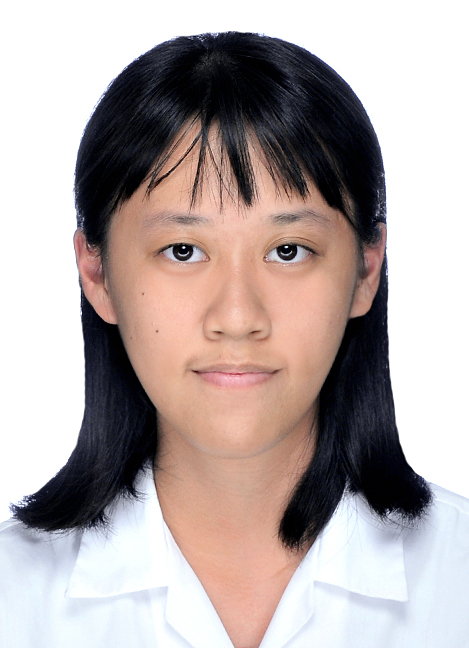

# 邱韻軒 Sharon Chiu｜履歷

---

## 學歷

- **國立中央大學 資訊管理學系（2023年9月－在學）**  
  ．學業平均：92.31（至大二上）  
  ．修習課程：C語言、Java、Python、網頁設計、企業資料通訊等  
  ．系上成績穩定，期末專案與模型訓練作品認真投入（Python 課程最終成績 94 分）

- **中山醫學大學 生物醫學系（2022年9月－2023年6月）**  
  ．系排第 2 名，普通生物學排名 1/100  
  ．因考量未來職涯規劃選擇重考轉學

---

## 語言能力

- 全民英檢（GEPT）中高級通過（含口說與寫作）
- 英文能力良好，具備技術文件翻譯經驗
- 於今年3月獲得雅思6.5的成績

---

## 實習經驗

- **中華電信楊梅研究院｜實習生（2024 暑假）**  
  ．進行中英文資料的文字標註與翻譯處理  
  ．協助文件前處理與文字分析任務  
  ．培養對語言資料與標註系統的理解

---

## 專案與競賽經驗

- **AI Junior 學生競賽｜網站提案開發（2025 冬）**  
  ．組隊完成網站提案與簡易原型設計  
  ．問卷調查、網站視覺設計

- **GDSC 社團成員（Google Developer Student Clubs）（2023－）**  
  ．參與課餘工作坊學習前後端與實作能力  
  ．自主進修強化技術觀念與應用能力

- **二手書平台協作維運（系上活動）**  
  ．協助資料整理與管理，擔任財務管理組員，提升資訊整合與溝通能力

- **網頁期末專題**  
  ．協助小組整合資料、安排開會進度，進行前端設計與報告講解

---

## 高中歷程與技能啟蒙

- **智慧機器人社｜社員與競賽選手**  
  ．曾參加全國創意智能機器人主題競賽  
  ．執行機器人組裝、程式撰寫與功能測試  
  ．養成邏輯思維與組織規劃能力

- **技職博覽會與國中營隊教學**  
  ．擔任機器人營隊指導員，培養臨場應對與溝通能力

---

## 技能專長

- 程式語言：C、Python、Java
- 網頁前端：HTML、CSS、JavaScript
- 資料分析：Pandas、Numpy、Scikit-learn（模型訓練實作）
- 版本控制：Git
- 文書處理：Word、PowerPoint（具簡報製作經驗）

---

## 自我介紹與展望

我是一個有邏輯、有責任感，能夠不斷自我調整與進步的人。從高中機器人社的摸索，到大學在程式開發與資料應用領域的學習與實作，我不斷拓展自己的技能邊界。未來希望能在貴公司進一步提升業界實戰能力，並在專案中持續精進技術與團隊協作經驗。

---

如有問題歡迎聯絡：sharon911023@gmail.com